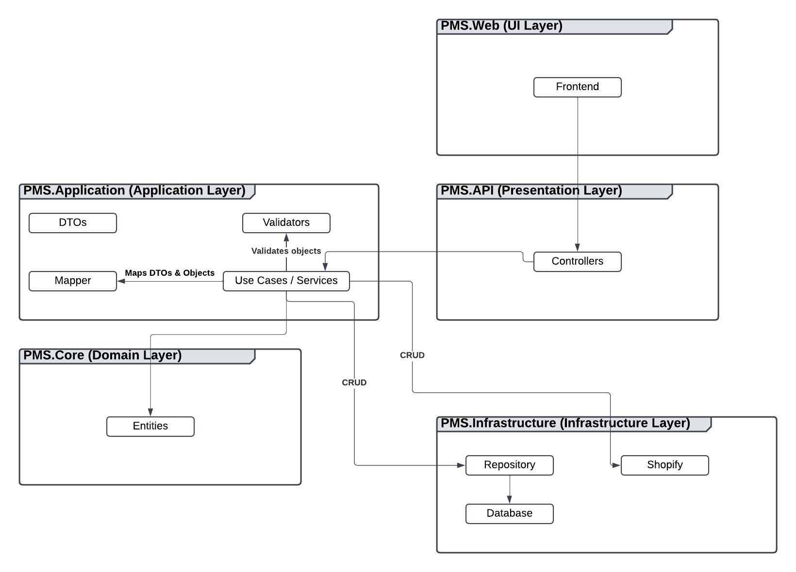

# PMS-WePack
Systemet er skrevet i C# ved brug af .NET

## Arkitektur
Arkitekturen der er brugt er Clean Architecture. Fordelen ved at adskille systemet i lag er at få højere testbarhed og vedligeholdelse.
  
Arkitekturen har fem lag i sig:

<ul>
    <li>PMS.Core</li>
    <li>PMS.Application</li>
    <li>PMS.Infrastructure</li>
    <li>PMS.API</li>
    <li>PMS.Web</li>
</ul>

### PMS.Core / Domain Layer
Domain layer kender ikke til andre lag i arkitekturen.
  
<b>Indeholder:</b>
Entities Det vil sige alle vores centrale objekter (Product, Category)
 
Dette indeholder kernen i systemet.

### PMS.Application / Application layer
Application layer kender til Domain Layer og Infrastructure igennem interfaces. 
Application layer er ansvarlig for use cases, og være en bro, der sikrer flower igennem lagene: API, infrastructure, domain.
  

<b>Indeholder:</b>
<ul>
    <li><b><i>DTOs:</b></i> Så vi kan kaste objekter frem og tilbage, uden at bekymre os om, vi sender data med, som bruger ikke skal kunne se. (F.eks et password)</li>
    <li><b><i>Use cases;</b></i> Funktionalitet som CreateProduct.</li>
    <li><b><i>Services;</b></i> der koordinerer flowet mellem Application layer og Infrastructure layer.</li>
    <li><b><i>Mapper:</b></i> Mapper objekter fra domain layer med tilsvarende DTO</li>
    <li><b><i>Validators:</b></i> Validering til objekter, om de f.eks har en maks længde på navnet.</li>
</ul>

Når der bliver oprettet et produkt, vil metoden CreateProduct bliver kaldt.  
Denne metode refererer til en anden metoden AddAsync, der ligger i infrastructure laget - I dette lag og metode ligger selve logikken, isoleret,  hvordan produktet gemmes.

### PMS.Infrastructure / Infrastructure Layer
Kender til Domain layer.
  
Database Har forbindelsen til databasen, samt migrations. 
Repository: Logik til at håndtere data til databasen. Det er f.eks her logikken til at oprette et produkt i databasen sker. 
Services: Gør vi brug af eksterne services. F.eks når vi håndterer data igennem Shopify / GraphQL

### PMS.API / Presentation Layer
Kender til Application layer.
  
Dette er vores API. 
Den håndterer HTTP requests og response, det er denne backend logic som bruger første gang møder.. Det er f.eks de metoder som Web laget referer til. 
De requests der kommet ind, sørger API for at tildele til metoder i Application Layer og returne til frontend.

### PMS.Web / UI Layer
Kender til Presentation Layer 
Dette er frontend og har alt som bruger ser og interagerer med. Alle requests bliver sendt igennem APIen. 

## Arkitekturen i diagram

## Csv and Filenames
filenames should ends with "-command.csv" 
command tells the system how to handle the file 
Available commands:
- create (creates product(s))
- update (updates product(s))
- delete (deletes product(s))

### Docker commands
`docker build` 
`docker compose up` 

### Dotnet commands
`dotnet build` 
`dotnet restore` 
`dotnet list package` 
`dotnet test` 
`dotnet ef database update --project src/PMS.Infrastructure/PMS.Infrastructure.csproj --startup-project src/PMS.API/PMS.API.csproj` 
`dotnet aspnet-codegenerator controller -name CategoryController -async -api -outDir Controllers/Category` 

#### URL
`[localhost:port]/swagger/index.html`